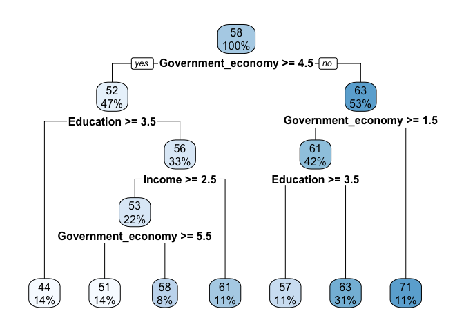
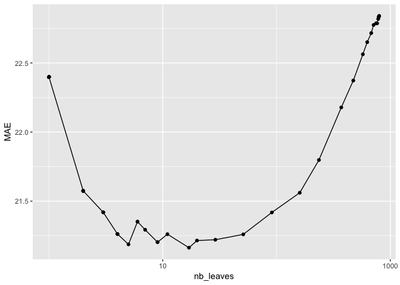
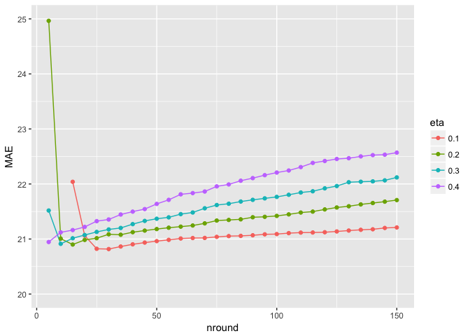
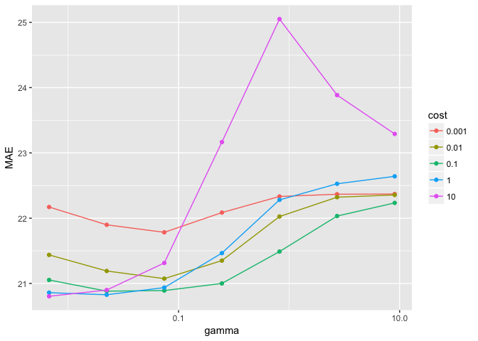
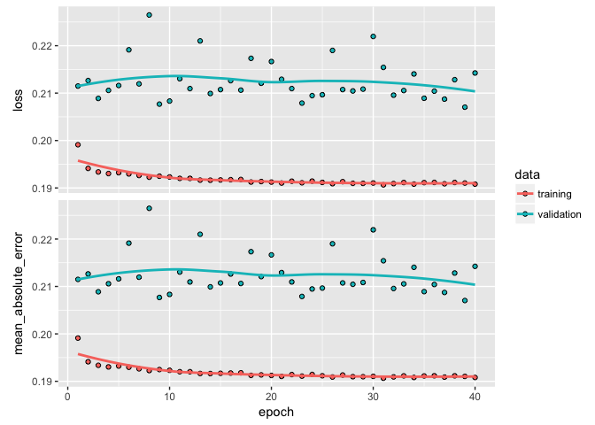

Regression analysis with political data
================
Guillaume Coqueret

The following document shows the potential of regression analysis applied to political data. The examples are simple illustrations that can be generalized to much more ambitious studies.

We refer to the companion paper (*Supervised learning with political data* by Guillaume Coqueret) for comments on the results below, **as well as for the presentation of the database**.

------------------------------------------------------------------------

**DISCLAIMER**: the data and code are meant for pedagogical and research use only. The original collector of the data, ANES, and the author bear no responsibility for use of the data or for interpretations or inferences based upon such uses.

------------------------------------------------------------------------

The script requires a large number of packages. You can copy-paste the line below to install most of them. install.packages(c("tidyverse", "rpart.plot", "xgboost", "e1071", "keras", "dummies"))

Additionally, the section on neural networks requires the installation of a recent version of Python.

**THE TASK** is to predict the feeling towards unions based on the following variables: Age, Gender, Education, Income, Church\_attendance, Home\_ownership, Abortion, Feeling\_unions, Foreign\_policy, and Government\_economy. **TRAINING SET**: 1986-2008, **TESTING SET: 2012-2016**.

Data preparation
----------------

``` r
library(tidyverse)
load("anes.RData")    # Import ANES database
beg_train <- 1985     # Start date for training sample
end_train <- 2010     # End date for training sample (and beginning for testing sample)
vars <- c("Age", "Gender", "Education", "Income", "Church_attendance", "Home_ownership", "Abortion", "Feeling_unions", "Foreign_policy", "Government_economy")
train <- anes %>% filter(Date > beg_train & Date < end_train) %>% select(vars)
test <- anes %>% filter(Date > end_train) %>% select(vars)
i <- sapply(train, is.factor)                       # Find non-numerical (factor) columns
train[i] <- sapply(train[i], as.numeric)            # Digitize factors
test[i] <- sapply(test[i], as.numeric)              # Digitize factors
train <- train %>% filter(rowSums(is.na(train))==0) # Remove rows with NAs
test <- test %>% filter(rowSums(is.na(test))==0)    # Remove rows with NAs
```

Linear regression
-----------------

``` r
fit <- lm(Feeling_unions ~ ., data = train)
summary(fit)
```

    ## 
    ## Call:
    ## lm(formula = Feeling_unions ~ ., data = train)
    ## 
    ## Residuals:
    ##     Min      1Q  Median      3Q     Max 
    ## -80.207 -14.689  -0.901  16.767  59.371 
    ## 
    ## Coefficients:
    ##                    Estimate Std. Error t value Pr(>|t|)    
    ## (Intercept)        84.94495    2.27960  37.263  < 2e-16 ***
    ## Age                -0.02701    0.01551  -1.742   0.0816 .  
    ## Gender              2.12366    0.50085   4.240 2.25e-05 ***
    ## Education          -4.07718    0.30674 -13.292  < 2e-16 ***
    ## Income             -2.19488    0.25863  -8.487  < 2e-16 ***
    ## Church_attendance  -0.02960    0.16862  -0.176   0.8607    
    ## Home_ownership      0.82113    0.58431   1.405   0.1600    
    ## Abortion            0.20731    0.25060   0.827   0.4081    
    ## Foreign_policy     -0.38553    0.57885  -0.666   0.5054    
    ## Government_economy -2.86120    0.13734 -20.833  < 2e-16 ***
    ## ---
    ## Signif. codes:  0 '***' 0.001 '**' 0.01 '*' 0.05 '.' 0.1 ' ' 1
    ## 
    ## Residual standard error: 24.1 on 9806 degrees of freedom
    ## Multiple R-squared:  0.1064, Adjusted R-squared:  0.1056 
    ## F-statistic: 129.7 on 9 and 9806 DF,  p-value: < 2.2e-16

Performance metric: the Mean Absolute Error, which we compute below.

``` r
fit <- lm(Feeling_unions ~ ., data = train)
pred <- predict(fit,test)
mean(abs(pred-test$Feeling_unions),na.rm=T)
```

    ## [1] 21.22539

Regression trees
----------------

A simple tree:

``` r
library(rpart)
library(rpart.plot)
fit <- rpart(Feeling_unions ~ ., data = train, cp = 0.003)
rpart.plot(fit)
```



Sensitivity to the number of leaves:

``` r
reg_tree_cp <- function(train, test, cp){                   # Function for automation
  fit <- rpart(Feeling_unions ~ ., data = train, cp = cp)   # Fits the tree
  pred <- predict(fit, test, type="vector")                 # Computes the predicted values
  x <- c()
  x$MAE <- mean(abs(pred-test$Feeling_unions))              # Computes the MAE
  x$nb <- sum(fit$frame$var=="<leaf>")                      # Computes the number of leaves
  return(x)
}

cp <- 0.8^(1:48)    # Complexity of the tree
# The line below may take some time
MAE <- cp %>% map(~reg_tree_cp(train = train, test = test, .x)) %>% unlist() %>% matrix(ncol = 2, byrow = T)
df <- data.frame(cp, MAE)
colnames(df)[2:3] <- c("MAE","nb_leaves") 
ggplot(df,aes(nb_leaves,MAE)) + geom_line() + geom_point() + scale_x_log10() 
```



Boosted trees
-------------

Can we do better?

``` r
library(xgboost)
train_data <- train %>% select(-Feeling_unions) 
test_data <- test %>% select(-Feeling_unions)
i <- sapply(train_data, is.factor)                  # Find non-numerical (factor) columns
train_data[i] <- sapply(train_data[i], as.numeric)  # Digitize factors
train_data <- train_data %>% data.matrix()       
test_data[i] <- sapply(test_data[i], as.numeric)    # Digitize factors
test_data <- test_data %>% data.matrix()
train_label <- train$Feeling_unions %>% as.numeric() %>% matrix()
test_label <- test$Feeling_unions %>% as.numeric()  %>% matrix()
train_matrix <- xgb.DMatrix(data = train_data, label = train_label) # XGBoost matrix format
test_matrix <- xgb.DMatrix(data = test_data, label = test_label)    # XGBoost matrix format

boosted_reg_tree <- function(train,test,nround,eta){                # Function => automation
  fit <- xgb.train(eta = eta, objective = "reg:linear",
                   data = train_matrix, 
                   nrounds = nround)
  pred <- predict(fit, test_matrix)
  return(mean(abs(pred-test_label)))
}

nround <- 5*(1:30)                  # Number of trees
eta <- 0.1*(1:4)                    # Learning rate
pars <- expand.grid(nround, eta)
nround <- pars[,1]
eta <- pars[,2]
# The following command may take some time
df <-  map2(nround, eta, boosted_reg_tree, train = train_matrix, test = test_matrix) %>% unlist()
df <- data.frame(pars, df)
colnames(df) <- c("nround", "eta", "MAE")
df$eta <- df$eta %>% as.factor()
ggplot(df,aes(nround, MAE, color=eta)) + geom_line() + geom_point() + ylim(20,25)
```



Which variables matter most? Let's see:

``` r
fit <- xgb.train(eta = 0.1, objective = "reg:linear", num_class = 1,   # Fit one tree
          data = train_matrix, nrounds = 20) 
importance <- xgb.importance(model = fit) 
feat <- colnames(train_data)[as.numeric(importance$Feature)+1]            # Features start at 0, hence +1
data.frame(feat, importance$Gain)
```

    ##                 feat importance.Gain
    ## 1 Government_economy      0.42897738
    ## 2          Education      0.20452515
    ## 3                Age      0.13590199
    ## 4             Income      0.10020379
    ## 5  Church_attendance      0.04401488
    ## 6             Gender      0.02734371
    ## 7           Abortion      0.02560311
    ## 8     Home_ownership      0.01736229
    ## 9     Foreign_policy      0.01606770

Support Vector Machines
-----------------------

``` r
library(e1071)
gamma <- exp(seq(-5, 3, 1.2))          # Radial kernel parameter
cost <- c(0.001, 0.01, 0.1, 1, 10)     # Cost / regularization parameter
pars <- expand.grid(gamma, cost)
gamma <- pars[,1]
cost <- pars[,2]

svm_2 <- function(train, test, gamma, cost){
  print(gamma) # This line allows to track the progress in the map2 function below: it can be deleted
  fit <- svm(Feeling_unions ~ ., data = train, kernel = 'radial', gamma = gamma, cost = cost, cachesize = 1000, tolerance = 0.005)
  pred <- predict(fit, test)
  return(mean(abs((pred-test$Feeling_unions))))
}

# The line below is VERY time-consuming on regular computers
df <-  map2(gamma, cost, svm_2, train = train, test = test) %>% unlist() 
df <- data.frame(pars, df)
colnames(df) <- c("gamma", "cost", "MAE")
df$cost <- df$cost %>% as.factor()
ggplot(df,aes(gamma, MAE, color = cost)) + geom_line() + geom_point() + scale_x_log10()
```



Neural networks
---------------

We stick to the simplest case: multilayer perceptron. We plot the improvement of the MAE based on the number of rounds of back-propagation.

``` r
library(keras)
# install_keras()  # If need be; this takes a few seconds
train_ann <- train_data
test_ann <- test_data
# Below we scale Age and Feeling_blacks in a hard-coded manner => beware!
train_ann[,1] <- train_data[,1] / 100
train_ann[,6] <- train_data[,6] / 100
test_ann[,1] <- test_data[,1] / 100
test_ann[,6] <- test_data[,6] / 100
model <- keras_model_sequential() 
model %>% 
  layer_dense(units = 32, activation = 'relu', input_shape = c(ncol(train_data))) %>%
  layer_dense(units = 16, activation = 'sigmoid') %>%
  layer_dense(units = 1)

model %>% compile(
  loss = 'mean_absolute_error',
  optimizer = optimizer_rmsprop(),
  metrics = c('mean_absolute_error')
)

ann <- model %>% fit(train_ann, train_label/100, epochs = 40, batch_size = 4, validation_data = list(test_ann, test_label/100))
plot(ann) # Note: the MAE is divided by 100
```



**CONCLUSION**: using the training sample average to predict all Feeling\_unions gives an MAE of 22.2. The best we could do here is 19.9, which is only a marginal improvement. Adding more variables (e.g., party affiliation or feelings) can help further reduces the MAE.
